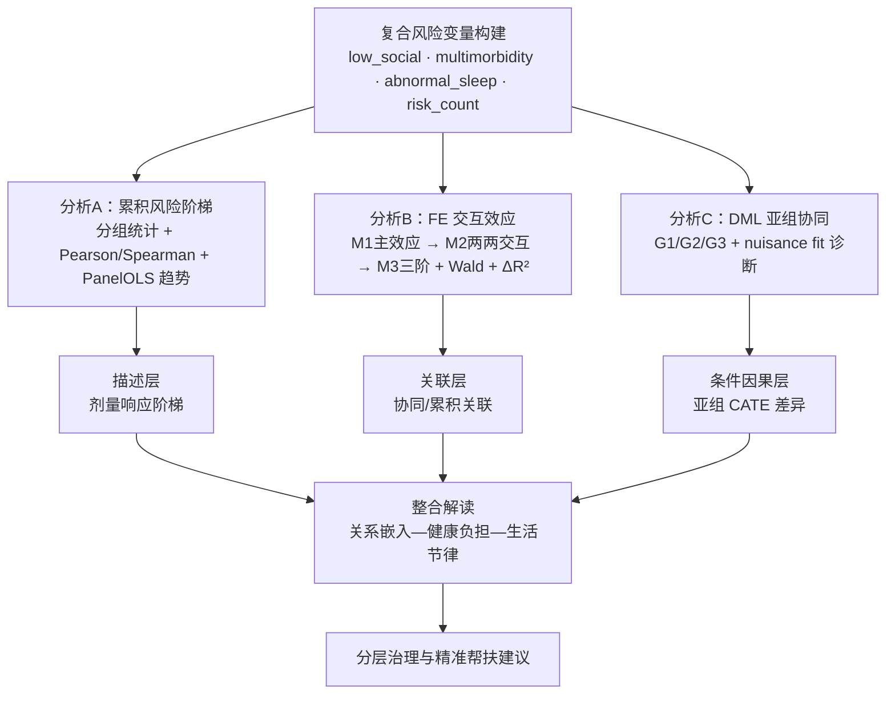

# Determinants, Heterogeneous Causal Effects, and Mitigation Pathways of Late-Life Depression in China

## 中国老年人抑郁倾向的复合风险、条件因果效应与分层治理 —— 基于 CHARLS 数据的因果机器学习研究

> Compound Risks, Conditional Causal Effects, and Stratified Governance of Depressive Symptoms among Older Adults in China: A Causal Machine Learning Study Using CHARLS Data

本仓库是同名社会学硕士学位论文的完整数据处理、建模与复现代码。研究基于 CHARLS 2011—2020 五期面板，在"社会资本—贫困健康—健康行为"三大理论整合框架下，借助可解释机器学习识别核心暴露因素，进而通过面板固定效应、双重机器学习与因果随机森林对老年抑郁倾向的成因、条件因果效应及其异质性进行系统估计，并补充复合风险与协同关联分析，最终落到分层治理的政策含义。

---

## 1. 研究问题

围绕三个彼此关联的问题展开。

第一，在中国情境下，哪些可干预因素与老年人抑郁倾向之间存在最稳健的关联？高维变量中谁应当被识别为核心暴露因素？

第二，在条件独立假设下，核心暴露因素对老年抑郁倾向是否具有可识别的平均因果效应？这些效应在性别、城乡、区域、经济水平、社会支持等结构性维度上如何分化？

第三，三个核心暴露因素之间是否存在协同或累积关联？识别"两种及以上风险共存"的高脆弱群体，对于从平均供给走向分层精准治理意味着什么？

## 2. 数据来源

中国健康与养老追踪调查（China Health and Retirement Longitudinal Study, CHARLS）2011、2013、2015、2018、2020 共五期非平衡面板。原始数据由北京大学国家发展研究院提供，本仓库不分发数据，运行前需要从 [CHARLS 官网](https://charls.pku.edu.cn/) 申请下载。

经清洗后的两套分析样本：

| 样本 | 用途 | 观测数 | 个体数 |
|---|---|---:|---:|
| FE 主样本（≥2 波次） | 面板固定效应基准回归与交互效应分析 | 36,738 | 10,801 |
| 因果样本（lagged 配对） | DML 平均因果效应、CRF 异质性、亚组协同 | 24,616 | 10,354 |

结果变量为 CES-D10 抑郁自评得分（连续，0—30），核心处理变量为社会参与指数、慢性病数量（多病共存）与睡眠时长（睡眠异常）。

## 3. 研究设计

本研究采用"理论预期—数据探索—理论校验—因果验证"的双重驱动路径：理论预期来自社会资本理论、贫困—健康理论、健康行为理论的整合框架；数据探索基于 LASSO、随机森林、XGBoost 三种学习器与 SHAP 可解释性分析的高维筛选；理论校验对 XML 筛选结果进行学理过滤；因果验证则由 FE/DML/CRF 三阶段构成，并补充复合风险与协同关联分析以回应风险维度交错叠加的现实复杂性。

完整研究技术路线图：

复合风险与协同关联分析模块的内部结构（对应第三章 3.6.7 节与第五章 5.6 节）：

## 4. 方法与模型

主分析采用三种互补的因果识别方法：

**面板固定效应（FE）** 用于在控制个体不可观测异质性后估计三个处理变量与抑郁得分之间的稳健关联。标准误按个体聚类，控制变量为人口学、家庭与经济基本特征。FE 估计结果在本研究中表述为"控制个体固定效应后的关联"，不作因果声明。

**双重机器学习（DML, Chernozhukov et al. 2018）** 在条件独立假设下估计平均因果效应。第一阶段 nuisance function 采用 XGBoost（n_estimators=500, max_depth=5），5 折交叉拟合重复 3 次取中位数。连续处理变量用部分线性回归（PLR），二元处理变量用交互回归模型（IRM）。处理变量取 t-1 期值，结果变量取 t 期值，以构造时序合理的 lagged 设计。

**因果随机森林（CRF, Wager & Athey 2018; Athey, Tibshirani & Wager 2019）** 用于估计个体异质性因果效应。报告 ATE、ITE 分布、GATE 分组结果、BLP 检验、变量重要度与高受益人群画像，并通过三种异质性证据的一致性比较进行三角验证。

补充分析包括：复合风险变量构建与累积风险阶梯描述、FE 复合风险交互三模型（M1/M2/M3）与 Wald 联合显著性检验、DML 三组亚组协同估计与 nuisance fit 诊断。详见 `scripts/s6_*.py` 系列脚本。

## 5. 仓库结构
